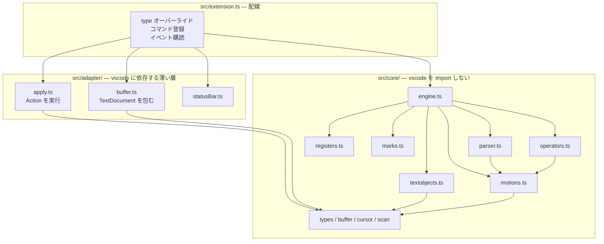
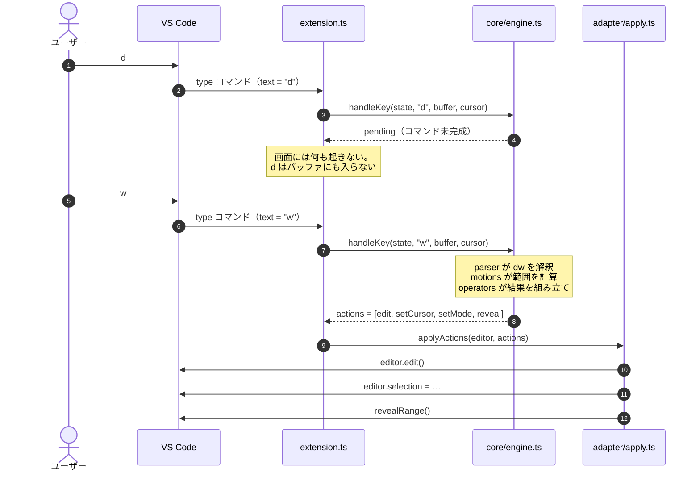
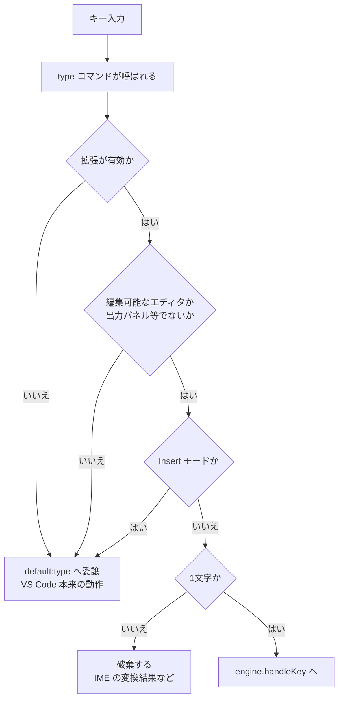
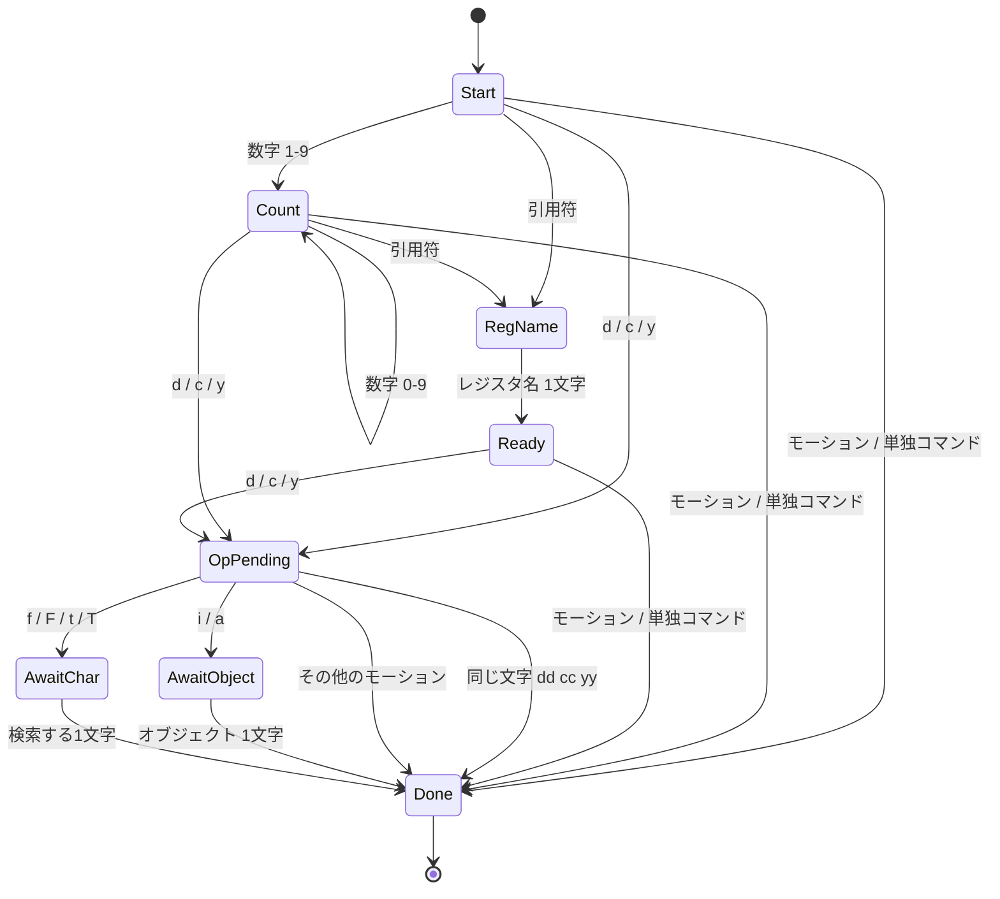

# 構造と動作機序

## フォルダ構造

```
vscode-extension-v/
├── .vscode/
│   ├── launch.json          F5 で Extension Development Host を起動する設定
│   └── tasks.json           起動前に走るビルドタスク（npm run watch）
│
├── src/
│   ├── core/                ★ vscode を import しない層。ロジックはすべてここ
│   │   ├── types.ts           Mode / Position / Range / RegisterContent
│   │   ├── buffer.ts          TextBuffer 抽象と行単位の範囲計算
│   │   ├── cursor.ts          Normal モードのカーソルクランプ規則
│   │   ├── scan.ts            文字単位の走査（行をまたぐ前進・後退・文字種）
│   │   ├── motions.ts         モーション表（h j k l w b e $ gg G f t …）
│   │   ├── textobjects.ts     テキストオブジェクト（iw aw i( a" …）
│   │   ├── operators.ts       オペレータ（d c y）と貼り付けの範囲計算
│   │   ├── registers.ts       レジスタの保管庫
│   │   ├── marks.ts           マークの保管庫（バッファごと）
│   │   ├── parser.ts          キー列 → コマンドオブジェクト
│   │   ├── excommands.ts      `:` で受け付ける Ex コマンドの表
│   │   ├── search.ts          パターンの照合と、次の一致の探索
│   │   ├── actions.ts         エンジンが返す副作用の記述（データ）
│   │   └── engine.ts          上記を束ねる。キーを受けて Action を返す
│   │
│   ├── adapter/             ★ vscode に依存する薄い層
│   │   ├── buffer.ts          TextDocument を TextBuffer として見せる
│   │   ├── apply.ts           Action を実際の編集・カーソル移動に変換
│   │   ├── transcript.ts      ターミナル出力の整形（vscode に依存しない）
│   │   ├── terminal.ts        出力の取り込みと、行のターミナルへの送信
│   │   ├── markIcon.ts        マーク名を描いた SVG の生成（vscode に依存しない）
│   │   ├── markDecorations.ts マークをガターに描く
│   │   └── statusBar.ts       モード表示
│   │
│   └── extension.ts         activate。type の乗っ取りとコマンド・イベントの配線
│
├── test/                    TypeScript で書き、コンパイルして node --test で実行
│   ├── harness.ts             run(text, keys) — 全テストの入口
│   ├── buffer.test.ts         範囲計算とクランプ
│   ├── motions.test.ts        モーション
│   ├── operators.test.ts      オペレータ・レジスタ・単独コマンド
│   ├── linewise.test.ts       行単位の操作
│   ├── visual.test.ts         Visual モードとテキストオブジェクト
│   └── manifest.test.ts       構造を守るテスト（後述）
│
├── docs/                    このフォルダ
├── package.json             コマンド・キーバインド・設定の宣言
└── tsconfig.json            src と test をまとめて out/ へ出力
```

## レイヤと依存の向き

依存は**一方向**です。`src/core/` は `vscode` を一切知りません。この向きが崩れていないことは
[manifest.test.ts](../test/manifest.test.ts) が実際にソースを走査して検査します。



## キー1打が届くまで

エンジンは VS Code を呼びません。「何をすべきか」を `Action` の配列として返し、
アダプタだけがそれを実行します。下は `dw`（1単語削除）を打ったときの流れです。



`Action` は次の7種類だけです。適用の順序は **編集 → コマンド → モード → カーソル** と決まっており、
テストハーネスも同じ順序でエンジンを駆動します。だからテストの記述がそのまま
エディター上の挙動の説明になります。

| Action | 意味 |
| --- | --- |
| `edit` | 範囲をテキストで置き換える |
| `setMode` | モードを変える |
| `setCursor` | カーソルを置く |
| `setSelection` | Visual の選択範囲を張る |
| `executeCommand` | VS Code のコマンドを呼ぶ（`undo` の委譲） |
| `indent` | 行の字下げを VS Code に頼む（`>` `<`） |
| `notify` | 短い知らせを出す（知らない Ex コマンドなど） |
| `reveal` | カーソルを画面内へスクロール |

`indent` だけ、どの行をどちら向きに何段動かすかしか書きません。下げ幅・タブかスペースか・
言語ごとの設定はすべて VS Code 側にあり、コアが数字を決めるとエディタの設定と食い違うためです。
アダプタが対象行を選択してから `editor.action.indentLines` を呼び、そのあとに `setCursor` が
選択を置き換えます。Visual モードの `>` が Vim と同じく選択を解くのは、この順序の結果です。

## `type` の乗っ取りと、委譲の判断

Normal モードが「モード」として成立するのは、**割り当てのないキーを破棄する**からです。
それを可能にしているのが `type` コマンドのオーバーライドです。

ただし `type` はウィンドウ全体で1つしか登録できません。判断を誤ると VS Code 全体で
文字が打てなくなるため、自分のものだと確実に言えない入力はすべて委譲します。



Escape・`Ctrl` 系・矢印キー・`Backspace`・`Enter`・`Delete` は `type` に流れてこないため、
それらだけ `package.json` の `keybindings` で受けます。

**このうち `Backspace` `Enter` `Delete` は、受け止めないと Normal モードが成立しません。**
放っておくと VS Code の編集コマンドがそのまま働き、`type` をいくら押さえても Backspace が
1文字消し、Enter が行を割ってしまいます。Vim ではどれもモーションなので（`Delete` だけ `x`
相当）、`handleEditingKey` がその形で引き取ります。「Normal モードはバッファを変えない」を
保つには、`type` の乗っ取りだけでは足りないということです。その `when` 句には必ず `editorTextFocus` を伴わせ、Escape については
サジェストウィジェットなどが開いているときは譲るよう条件を絞っています。

## リマップ — パーサの手前に置く変換層

`nnoremap J 10j` のようなユーザー定義の置き換えは、パーサに手を入れずに実現しています。
キーがパーサに届く前に置き換えるだけだからです。

```
  打鍵  ─→  リマップ層  ─→  パーサ  ─→  エンジン  ─→  Action
             ↑                              │
             └──── 展開したキーは通さない ────┘
```

置き換えた結果（`1` `0` `j`）は `EngineResult.replay` として呼び出し側に返され、
アダプタが 1 キーずつ `handleLiteralKey` に流し直します。この経路がリマップ層を通らないため、
**`nnoremap` の非再帰性が構造から出てきます**。フラグで再帰を止めているわけではありません。

エンジン自身が展開を実行しないのは、`ddp` のような展開が「削除後のバッファ」を必要とするためです。
コアは編集を適用できないので、バッファを読み直せる呼び出し側に戻すしかありません。
テストハーネスも同じループを持っています。

置き換えを**適用してはいけない**場面が 2 つあります。

- **引数を 1 文字取るコマンドの、その 1 文字**。`f` `t` `r` `m` `` ` `` `'` の引数と、
  `"` に続くレジスタ名です。ここは生の文字として受け取るので、置き換えると `fJ` が文字 `J` を
  探せなくなり、`` `J `` が名前 `J` のマークを指せなくなります。パーサが `pending` を返すときに
  `awaitingLiteral` を添えて、リマップ層がそれを見て手を引きます。
- **Insert モード**。ここは `default:type` に丸投げする経路なので、置き換えは行いません。

複数キーの規則では、より長い規則が一致しうるあいだ次のキーを待ちます（`<leader>w` と
`<leader>wh` なら短いほうは発火しません）。Vim は `timeoutlen` で解決しますが、
**こちらは意図的にタイムアウトを持ちません**。手が止まっただけで打鍵が実行されるより、
確定するまで待つほうが安全だと判断しました。

その代わり、**待機中のキーをステータスバーに出します**。これがないと、leader がスペースの
とき「待っている」のか「無視された」のかが画面上で区別できません。タイムアウトを捨てた
以上、待っていることが見えるのは機能の一部です。スペースは `␣` として描画します。

```
$(circle-large-outline) NORMAL  ␣w
```

`<leader>` は設定時に実際のキーへ解決されるので、エンジンとパーサは leader の存在を知りません。
`{ before: ["<leader>", "h"] }` は `vimLike.leader` が既定なら `[" ", "h"]` として表に入るだけです。

## 検索 — `/` を `n` に翻訳する

`/` `?` は `:` と同じコマンドライン（ステータスバーの入力欄）を共有します。違うのは確定したあとで、
検索はカーソルを直接動かしません。**パターンを覚えてから、`/` の前に打たれていたキーに `n` を
足して流し直します**。

```
  d / f o o <CR>
  └┬┘ └──┬──┘
   │     └─ パターンとして記憶
   └─────── 保留されたキー
                  ↓
            replay: d n     ← 既存の「オペレータ + モーション」の経路
```

`d/foo<CR>` は「パターンを覚えたうえでの `dn`」と同じものになるので、オペレータもカウントも
Visual モードも、それぞれの実装をもう一度書かずに済みます。リマップの `replay` と同じ仕組みです。

`vimLike.search` を `editorFind` にすると、この経路ごと VS Code の検索バーに置き換わります。
コアが返すのは `find` アクション（`open` / `next` / `previous`）だけになり、パターンの記憶も
照合もアダプタの向こう側の VS Code が持ちます。**その代わり `n` はモーションでなくコマンドに
なるので、`dn` は成立しません**。着地点をコアが知らないまま削除するより、できないと伝えるほうを
選んでいます（`notify` を返します）。2つの方式の差は README の表にまとめてあります。

`n` `N` `*` `#` はモーション表のエントリで、直前の検索を `MotionContext.search` として受け取ります。
検索の状態はエンジンが持ちます（1打鍵より長生きするため）。モーション自身は文脈の純粋関数のままです。
`*` と `#` だけは「カーソル下の単語を検索語にする」という副作用を伴うので、エンジンがモーションを
呼ぶ前にそこを済ませます。

## `.` — 完成したコマンドをそのまま取っておく

パーサが `Command` というオブジェクトを組み立てているので、`.` は**最後に変更を起こした
`Command` を同じ経路にもう一度流す**だけで済みます。オペレータ・カウント・テキストオブジェクトの
それぞれに繰り返し用の実装は要りません。記録は `execute()` の1箇所で行うので、新しいコマンドを
足せばその時点で `.` の対象になります。

「変更」の判定は、返ってきた `Action` を見て決めます。`edit` か `indent` があるか、Insert モードに
入ったものが変更です。ヤンクもモーションもどちらも生まないので、自然に対象外になります。

Insert を伴う変更（`cwbye<Esc>`）だけは1打鍵で完結しません。打鍵を覗く代わりに、**Insert を抜けた
時点でバッファから読み戻します**。挿入の開始位置は記録済みで、終了位置は Escape 時のカーソルなので、
その範囲のテキストが「打った内容」です。Insert 中に `default:type` へ丸投げしている方針を崩さずに
済みます。繰り返すときは、コマンド自身の編集とこのテキストを1つの `edit` にまとめます
（同じ位置に触る編集を2つ出すと、VS Code の編集ビルダーが重なりを拒むためです）。

## マーク — バッファごとに持ち、ジャンプだけが足跡を残す

`ma` で覚えた位置へ `` `a `` と `'a` で戻ります。実装はレジスタとほぼ同じ形で、`marks.ts` が
保管庫を持ち、エンジンがそれをモーションに渡します。設計として決めたことが 2 つあります。

**保管庫はバッファごとに分けています。** Vim の小文字マークがバッファ単位なのと同じ理由で、
ファイル A で覚えた行番号をファイル B に当てても意味がないからです。そのために `TextBuffer` に
`id` を足し、アダプタが `document.uri` を渡します。コアは URI が何かを知らないまま、
「同じ文書かどうか」だけを区別できます。

**どの移動が足跡を残すかは、モーション表の `isJump` が決めます。**

```ts
G:   { kind: 'linewise', isJump: true,  … }   // `` で戻れる
j:   { kind: 'linewise',                 … }   // 戻り先は書き換わらない
```

`G` `gg` `{` `}` `%` `n` `N` `*` `#` と、マーク自身への移動が該当します。エンジンは
**モーションが成功したあとに**現在位置を記録します。先に記録すると、失敗した `` `x `` が
本来戻るはずだった位置を上書きしてしまうためです。

マークは編集に追従しません。追従させるには文書の変更を購読して保管中の位置を書き換える必要が
あり、まだ入れていません。読み出すときに範囲へ丸めているので、行が消えても落ちはしませんが、
指す場所はずれます。

### ガターへの表示

マークを付けた行には、行番号の横にマーク名が出ます。VS Code のガターは文字ではなく画像を取るので、
**文字を描いた SVG を生成**してアイコンにしています。ガターアイコンは画像であって装飾された要素では
ないため `ThemeColor` に追従できません。明るいテーマ用と暗いテーマ用を 2 枚作り、
`DecorationRenderOptions` の `light` / `dark` で出し分けています。

SVG を組み立てる部分（`markIcon.ts`）は `vscode` を import していません。おかげでガターに何が
出るかをテストで確かめられます。装飾の型は文字ごとに 1 つ作って使い回します。VS Code は装飾を
その型で識別するので、打鍵のたびに作り直すと古いアイコンが残るためです。

描くのは `m` で付けた名前付きマークだけです。`` `` `` の戻り先は大きな移動のたびに変わるので、
出すと目障りになります。

### `:marks` — 一覧から飛ぶ

コアは一覧の中身（マーク名・位置・その行のテキスト）を `showMarks` アクションとして組み立てるだけで、
どう見せるかはアダプタが決めます。今はピッカーですが、一覧そのものはその選択に依存しません。

選んだ行へは、カーソルを直接動かしていません。**`` ` `` とマーク名をエンジンに流し直します**。

```
  ピッカーで a を選ぶ  ─→  feed('`') → feed('a')  ─→  通常のジャンプ経路
```

こうすると、打鍵で `` `a `` した場合とまったく同じ経路を通ります。戻り先の記録もカーソルの
クランプも書き直さずに済み、検索が `/` を `n` に翻訳しているのと同じ考え方です。

一覧には `` `` `` の戻り先も載せます。ガターでは目障りでも、「どこから飛んできたか」は
一覧では知りたい情報だからです。同じデータでも見せ方によって適切な取捨選択が違います。

### `:delmarks` — Ex コマンドの表に開けた唯一の例外

`excommands.ts` は「引数を解釈しない表」として作ってあります。Ex の引数構文は範囲・レジスタ・
ファイル名と際限がなく、パーサを書き始めると全部を招き入れてしまうためです。`:delmarks` だけは
その例外にしました。

例外にできるのは、**マーク名が閉じた文法だから**です。1文字の英小文字と `a-d` 形式の範囲しかなく、
Ex の引数を開かれたものにしている要素がひとつも入りません。例外にする価値があるのは、引数がないと
`:delmarks!` の「全部消す」しか残らず、1文字だけ空けたいときに使えないからです。

引数が解釈できないときは `E475: Invalid argument` を、引数がないときは Vim と同じ
`E471: Argument required` を返します。コマンド自体は存在するので、`E492`（そんなコマンドはない）
とは区別しています。

## パーサ — Vim の文法をそのまま state machine に

```
   [count]  [ "reg ]  [count]  operator  [count]  { motion | text-object }

      2        "a                  d         3              w
      └──────────┬──────────┘      │         └───────┬──────┘
        どのレジスタに、何回        何を          どこまで
```

カウントはオペレータの前後どちらにも置け、両方あれば掛け算されます（`2d3w` は6単語）。



実装上は、状態を持ち回す代わりに**溜まったキー列を毎回まるごと解析し直しています**。
`parse(keys, mode)` が純粋関数になるためテストが容易で、キー列は数文字を超えないので
コストも問題になりません。結果は `pending`（キー待ち）/ `invalid`（破棄）/ `complete` の3つです。

## 設計の要 — モーションが自分の種別を申告する

`dw` と `de` は同じ `d` でありながら削除量が違います。この違いをオペレータ側で場合分けすると、
機能が増えるたびに `オペレータ数 × モーション数` の分岐が要ります。

そこで **exclusive / inclusive / linewise という区分をモーション自身に持たせました**。

```
テキスト:   h  e  l  l  o  ␣  w  o  r  l  d
列:         0  1  2  3  4  5  6  7  8  9  10
カーソル:   ^

    w が着地する列 → 6（次の単語の先頭）
    e が着地する列 → 4（この単語の最後の文字）

    dw   w は exclusive  着地点を含めない  0..6 を削除  → "world"
    de   e は inclusive  着地点を含める    0..5 を削除  → " world"
    dj   j は linewise   列を無視して行ごと            → 2 行削除
```

オペレータは「範囲を消す・写す・消して Insert に入る」だけを担当し、範囲の決め方は知りません。
このおかげで実装量は `オペレータ数 + モーション数` に収まり、**新しいモーションの追加は
`motions.ts` のテーブルに1行足すだけ**で、すべてのオペレータから使えるようになります。

テキストオブジェクト（`iw` `a(`）も同じ「範囲を返すもの」として扱われるため、`diw` も `viw` も
オペレータから見れば区別がありません。

## Vim と VS Code のカーソルの差

Vim のカーソルは文字の**上**にあり、行末は最後の文字です。VS Code のカーソルは文字の**間**に
あり、最後の文字の後ろまで行けます。

```
Vim          a  b  c            VS Code      a  b  c
             ^  ^  ^                        ^  ^  ^  ^
          有効な位置は3つ                 有効な位置は4つ
```

この差を放置すると `$` `x` `p` の挙動が少しずつずれます。規則は [cursor.ts](../src/core/cursor.ts) の
`clampCursor` 1箇所だけに置き、すべてのモーションがそこを通ります。Visual モードでは
さらに「Vim の選択は着地点の文字を含む」ため、[apply.ts](../src/adapter/apply.ts) が描画時に1文字
広げ、エンジンへ返すときに1文字戻します。

## テスト

`npm test` で実行します。Node.js 標準のテストランナーのみを使い、`@vscode/test-electron` は
導入していません。VS Code を起動しないぶん実行は速く、コア層に依存がないからこそ成り立ちます。

テストも TypeScript で書き、`tsc` でコンパイルしてから走らせます。こうすることで、コアの型を
変えたときにテスト側にも型検査が波及します。

すべてのふるまいテストは `test/harness.ts` の `run(text, keys)` を通ります。
ハーネスは実際のアダプタと同じ順序でエンジンを駆動する、文字列版のエディタです。

```ts
assert.equal(run('hello world', 'dw').text, 'world');
assert.equal(run('one\ntwo\nthree', 'dd', { cursor: pos(2, 0) }).text, 'one\ntwo');
assert.equal(run('foo(bar)baz', 'ci(X<Esc>', { cursor: pos(0, 5) }).text, 'foo(X)baz');
```

これに加えて、コードの構造そのものを守るテストを [manifest.test.ts](../test/manifest.test.ts) に
置いています。

| 検査 | 防いでいること |
| --- | --- |
| 全キーが VS Code の有効なキー名か | `"key": "$"` のように黙って無視されるキーバインド |
| `contributes.commands` が全て登録されているか | 宣言だけあって実体のないコマンド |
| 全キーバインドに `editorTextFocus` があるか | ターミナルや検索欄でキーを奪う事故 |
| Escape がウィジェットを除外しているか | サジェストを Escape で閉じられなくなる事故 |
| `src/core/` が `vscode` を import していないか | レイヤ違反によるテスト不能化 |

## CI

[`.github/workflows/ci.yml`](../.github/workflows/ci.yml) が push と Pull Request で
`npm run lint` → `npm run typecheck` → `npm test` を実行します。

Node のバージョンは [`mise.toml`](../mise.toml) だけに書いてあり、CI もそれを読みます
（`jdx/mise-action`）。ワークフロー側にバージョンを書かないことで、手元と CI の版が
ずれようがない状態にしています。この拡張機能が実際に動くのは VS Code に同梱された Node なので、
複数バージョンで並行して試すより、開発ツールチェーンの版を1つに固定するほうが実利があります。

ESLint は型情報を使う設定（`recommendedTypeChecked`）にしています。目的はスタイルの統一よりも、
`editor.edit()` や `setContext` の `await` 忘れを `no-floating-promises` で捕まえることです。
この種の抜けは型検査を通ってしまう一方で、編集が反映される前にカーソルを置いてしまうという
実際の不具合になります。

なお `node:test` の `test()` は呼び出し側が await しない前提の関数なので、そこだけ
`allowForKnownSafeCalls` で安全と宣言しています。テストディレクトリ全体でルールを切ると、
テストヘルパの本当の await 忘れを見逃すためです。
