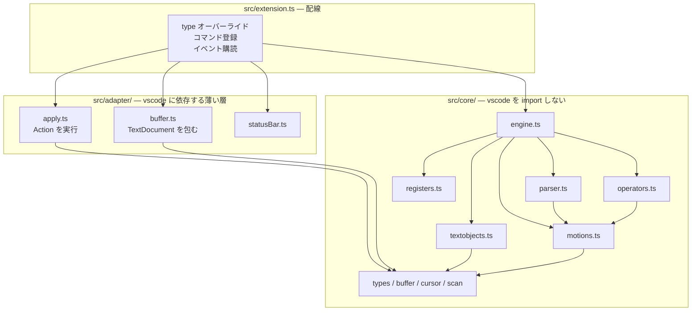
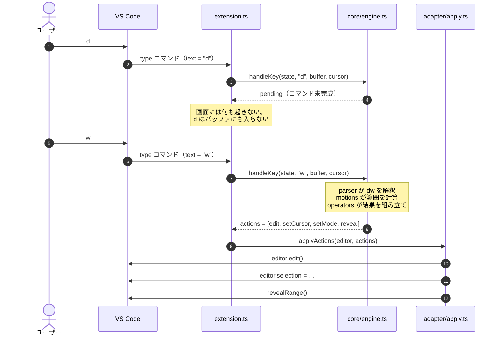
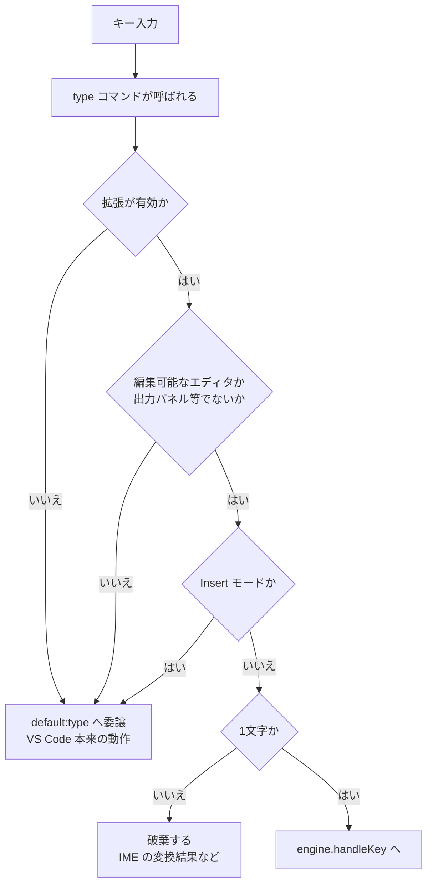
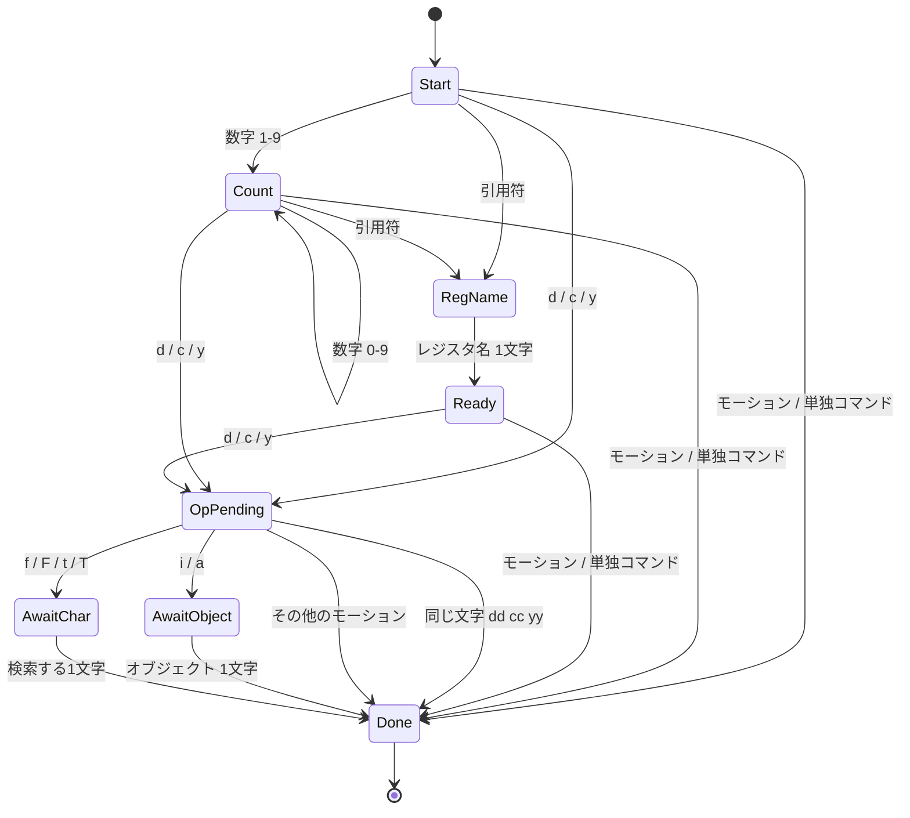

# 構造と動作機序

## フォルダ構造

```
vscode-extension-v/
├── .vscode/
│   ├── launch.json          F5 で Extension Development Host を起動する設定
│   └── tasks.json           起動前に走るビルドタスク（npm run watch）
│
├── src/
│   ├── core/                ★ vscode を import しない層。ロジックはすべてここ
│   │   ├── types.ts           Mode / Position / Range / RegisterContent
│   │   ├── buffer.ts          TextBuffer 抽象と行単位の範囲計算
│   │   ├── cursor.ts          Normal モードのカーソルクランプ規則
│   │   ├── scan.ts            文字単位の走査（行をまたぐ前進・後退・文字種）
│   │   ├── motions.ts         モーション表（h j k l w b e $ gg G f t …）
│   │   ├── textobjects.ts     テキストオブジェクト（iw aw i( a" …）
│   │   ├── operators.ts       オペレータ（d c y）と貼り付けの範囲計算
│   │   ├── registers.ts       レジスタの保管庫
│   │   ├── parser.ts          キー列 → コマンドオブジェクト
│   │   ├── actions.ts         エンジンが返す副作用の記述（データ）
│   │   └── engine.ts          上記を束ねる。キーを受けて Action を返す
│   │
│   ├── adapter/             ★ vscode に依存する薄い層
│   │   ├── buffer.ts          TextDocument を TextBuffer として見せる
│   │   ├── apply.ts           Action を実際の編集・カーソル移動に変換
│   │   └── statusBar.ts       モード表示
│   │
│   └── extension.ts         activate。type の乗っ取りとコマンド・イベントの配線
│
├── test/                    TypeScript で書き、コンパイルして node --test で実行
│   ├── harness.ts             run(text, keys) — 全テストの入口
│   ├── buffer.test.ts         範囲計算とクランプ
│   ├── motions.test.ts        モーション
│   ├── operators.test.ts      オペレータ・レジスタ・単独コマンド
│   ├── linewise.test.ts       行単位の操作
│   ├── visual.test.ts         Visual モードとテキストオブジェクト
│   └── manifest.test.ts       構造を守るテスト（後述）
│
├── docs/                    このフォルダ
├── package.json             コマンド・キーバインド・設定の宣言
└── tsconfig.json            src と test をまとめて out/ へ出力
```

## レイヤと依存の向き

依存は**一方向**です。`src/core/` は `vscode` を一切知りません。この向きが崩れていないことは
[manifest.test.ts](../test/manifest.test.ts) が実際にソースを走査して検査します。



## キー1打が届くまで

エンジンは VS Code を呼びません。「何をすべきか」を `Action` の配列として返し、
アダプタだけがそれを実行します。下は `dw`（1単語削除）を打ったときの流れです。



`Action` は次の6種類だけです。適用の順序は **編集 → モード → カーソル** と決まっており、
テストハーネスも同じ順序でエンジンを駆動します。だからテストの記述がそのまま
エディター上の挙動の説明になります。

| Action | 意味 |
| --- | --- |
| `edit` | 範囲をテキストで置き換える |
| `setMode` | モードを変える |
| `setCursor` | カーソルを置く |
| `setSelection` | Visual の選択範囲を張る |
| `executeCommand` | VS Code のコマンドを呼ぶ（`undo` の委譲） |
| `reveal` | カーソルを画面内へスクロール |

## `type` の乗っ取りと、委譲の判断

Normal モードが「モード」として成立するのは、**割り当てのないキーを破棄する**からです。
それを可能にしているのが `type` コマンドのオーバーライドです。

ただし `type` はウィンドウ全体で1つしか登録できません。判断を誤ると VS Code 全体で
文字が打てなくなるため、自分のものだと確実に言えない入力はすべて委譲します。



Escape・`Ctrl` 系・矢印キーは `type` には流れてこないため、それらだけ `package.json` の
`keybindings` で受けます。その `when` 句には必ず `editorTextFocus` を伴わせ、Escape については
サジェストウィジェットなどが開いているときは譲るよう条件を絞っています。

## パーサ — Vim の文法をそのまま state machine に

```
   [count]  [ "reg ]  [count]  operator  [count]  { motion | text-object }

      2        "a                  d         3              w
      └──────────┬──────────┘      │         └───────┬──────┘
        どのレジスタに、何回        何を          どこまで
```

カウントはオペレータの前後どちらにも置け、両方あれば掛け算されます（`2d3w` は6単語）。



実装上は、状態を持ち回す代わりに**溜まったキー列を毎回まるごと解析し直しています**。
`parse(keys, mode)` が純粋関数になるためテストが容易で、キー列は数文字を超えないので
コストも問題になりません。結果は `pending`（キー待ち）/ `invalid`（破棄）/ `complete` の3つです。

## 設計の要 — モーションが自分の種別を申告する

`dw` と `de` は同じ `d` でありながら削除量が違います。この違いをオペレータ側で場合分けすると、
機能が増えるたびに `オペレータ数 × モーション数` の分岐が要ります。

そこで **exclusive / inclusive / linewise という区分をモーション自身に持たせました**。

```
テキスト:   h  e  l  l  o  ␣  w  o  r  l  d
列:         0  1  2  3  4  5  6  7  8  9  10
カーソル:   ^

    w が着地する列 → 6（次の単語の先頭）
    e が着地する列 → 4（この単語の最後の文字）

    dw   w は exclusive  着地点を含めない  0..6 を削除  → "world"
    de   e は inclusive  着地点を含める    0..5 を削除  → " world"
    dj   j は linewise   列を無視して行ごと            → 2 行削除
```

オペレータは「範囲を消す・写す・消して Insert に入る」だけを担当し、範囲の決め方は知りません。
このおかげで実装量は `オペレータ数 + モーション数` に収まり、**新しいモーションの追加は
`motions.ts` のテーブルに1行足すだけ**で、すべてのオペレータから使えるようになります。

テキストオブジェクト（`iw` `a(`）も同じ「範囲を返すもの」として扱われるため、`diw` も `viw` も
オペレータから見れば区別がありません。

## Vim と VS Code のカーソルの差

Vim のカーソルは文字の**上**にあり、行末は最後の文字です。VS Code のカーソルは文字の**間**に
あり、最後の文字の後ろまで行けます。

```
Vim          a  b  c            VS Code      a  b  c
             ^  ^  ^                        ^  ^  ^  ^
          有効な位置は3つ                 有効な位置は4つ
```

この差を放置すると `$` `x` `p` の挙動が少しずつずれます。規則は [cursor.ts](../src/core/cursor.ts) の
`clampCursor` 1箇所だけに置き、すべてのモーションがそこを通ります。Visual モードでは
さらに「Vim の選択は着地点の文字を含む」ため、[apply.ts](../src/adapter/apply.ts) が描画時に1文字
広げ、エンジンへ返すときに1文字戻します。

## テスト

すべてのふるまいテストは `test/harness.ts` の `run(text, keys)` を通ります。
ハーネスは実際のアダプタと同じ順序でエンジンを駆動する、文字列版のエディタです。

```ts
assert.equal(run('hello world', 'dw').text, 'world');
assert.equal(run('one\ntwo\nthree', 'dd', { cursor: pos(2, 0) }).text, 'one\ntwo');
assert.equal(run('foo(bar)baz', 'ci(X<Esc>', { cursor: pos(0, 5) }).text, 'foo(X)baz');
```

これに加えて、コードの構造そのものを守るテストを [manifest.test.ts](../test/manifest.test.ts) に
置いています。

| 検査 | 防いでいること |
| --- | --- |
| 全キーが VS Code の有効なキー名か | `"key": "$"` のように黙って無視されるキーバインド |
| `contributes.commands` が全て登録されているか | 宣言だけあって実体のないコマンド |
| 全キーバインドに `editorTextFocus` があるか | ターミナルや検索欄でキーを奪う事故 |
| Escape がウィジェットを除外しているか | サジェストを Escape で閉じられなくなる事故 |
| `src/core/` が `vscode` を import していないか | レイヤ違反によるテスト不能化 |
